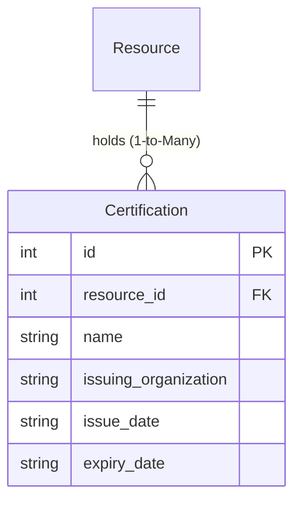

# Certification Model (`certification.py`)

## 1. Overview & Purpose

The [certification.py](file:///Users/kshitijkhandelwal_1/VSCode/ResourcePortal/ResourcePortal/src/resourceportal/models/certification.py) file defines the [`Certification`](file:///Users/kshitijkhandelwal_1/VSCode/ResourcePortal/ResourcePortal/src/resourceportal/models/certification.py#L7-L18) database model for the ResourcePortal backend.

### Why Does This File Exist?
In technology and professional consulting, formal certifications validate an engineer's practical skills. When bidding on client proposals (RFPs), enterprise clients often require verified numbers of certified practitioners (e.g., *"Must have 3 AWS Certified Solutions Architects and 2 CKA administrators on the delivery team"*).

The [`Certification`](file:///Users/kshitijkhandelwal_1/VSCode/ResourcePortal/ResourcePortal/src/resourceportal/models/certification.py#L7-L18) model stores:
- **Whose credential it is**: The employee ([`Resource`](file:///Users/kshitijkhandelwal_1/VSCode/ResourcePortal/ResourcePortal/src/resourceportal/models/resource.py#L9-L35)).
- **Credential details**: The name of the certificate and the granting authority (e.g., AWS, Google Cloud, Microsoft, CNCF).
- **Validity period**: When the certificate was issued and when it expires.

### Real-World Analogy
> [!NOTE]
> Think of a [`Certification`](file:///Users/kshitijkhandelwal_1/VSCode/ResourcePortal/ResourcePortal/src/resourceportal/models/certification.py#L7-L18) record as a **Framed Professional License or Certificate**:
> - It belongs to a specific practitioner ([`Resource`](file:///Users/kshitijkhandelwal_1/VSCode/ResourcePortal/ResourcePortal/src/resourceportal/models/resource.py#L9-L35)).
> - It is stamped with the issuing authority's seal (e.g., `"Amazon Web Services"`).
> - It has an expiration date, warning the owner and employer when it is time to renew.

---

## 2. Architecture & Entity Relationships

The [`Certification`](file:///Users/kshitijkhandelwal_1/VSCode/ResourcePortal/ResourcePortal/src/resourceportal/models/certification.py#L7-L18) model has a direct parent-child relationship with [`Resource`](file:///Users/kshitijkhandelwal_1/VSCode/ResourcePortal/ResourcePortal/src/resourceportal/models/resource.py#L9-L35):



---

## 3. Module Imports Explained

```python
from sqlalchemy import Column, ForeignKey, Integer, String
from sqlalchemy.orm import relationship

from resourceportal.database.database import Base
```

| Import | Origin | Why It's Needed |
| :--- | :--- | :--- |
| `Column` | `sqlalchemy` | Creates columns in the database table schema. |
| `ForeignKey` | `sqlalchemy` | Establishes the relationship constraint pointing to `resources.id`. |
| `Integer` | `sqlalchemy` | SQL integer type used for the primary key (`id`) and the foreign key (`resource_id`). |
| `String` | `sqlalchemy` | SQL string type for names, organizations, and date text. |
| `relationship` | `sqlalchemy.orm` | Builds object-level navigation so you can do `cert.resource` in Python. |
| `Base` | [`resourceportal.database.database`](file:///Users/kshitijkhandelwal_1/VSCode/ResourcePortal/ResourcePortal/src/resourceportal/database/database.py#L12) | Declarative Base registry for SQLAlchemy ORM mapping. |

---

## 4. Class Definition: [`Certification`](file:///Users/kshitijkhandelwal_1/VSCode/ResourcePortal/ResourcePortal/src/resourceportal/models/certification.py#L7-L18)

```python
class Certification(Base):
    __tablename__ = "certifications"
```

- **`__tablename__ = "certifications"`**: Directs SQLAlchemy to map instances of this class to the `"certifications"` table in the database.

### Table Columns & Attributes

| Field Name | Type | Constraints & Defaults | Plain English Explanation & Purpose |
| :--- | :--- | :--- | :--- |
| `id` | `Integer` | `primary_key=True`, `index=True` | Unique database identifier for this certification record. |
| `resource_id` | `Integer` | `ForeignKey("resources.id")`, `nullable=False` | The ID of the employee who holds this certificate. Cannot be null because a certification must belong to an employee. |
| `name` | `String` | `nullable=False` | The title of the credential (e.g., `"Certified Kubernetes Administrator (CKA)"`). |
| `issuing_organization` | `String` | `nullable=True` | The agency or vendor that awarded the certificate (e.g., `"The Linux Foundation"`, `"Microsoft"`). |
| `issue_date` | `String` | `nullable=True` | The date the certificate was earned (e.g., `"2025-05-10"`). |
| `expiry_date` | `String` | `nullable=True` | The date the certificate expires (e.g., `"2028-05-10"`). Useful for alerts when renewals are due. |

---

## 5. Relationships & Navigation

```python
resource = relationship("Resource", back_populates="certifications")
```

### `resource` (Many-to-One)
- **Target Model**: [`Resource`](file:///Users/kshitijkhandelwal_1/VSCode/ResourcePortal/ResourcePortal/src/resourceportal/models/resource.py#L9-L35)
- **Foreign Key**: `resource_id` references `resources.id`
- **What it does**: Allows instant access to the owner of this certification in Python (`cert.resource.name`, `cert.resource.email`).
- **`back_populates="certifications"`**: Keeps the bidirectional relationship synchronized with `Resource.certifications` (on [`Resource`](file:///Users/kshitijkhandelwal_1/VSCode/ResourcePortal/ResourcePortal/src/resourceportal/models/resource.py#L33)).

---

## 6. How It Works in Practice

```python
from resourceportal.models.certification import Certification

# Record a new certification
cert = Certification(
    resource_id=12,
    name="AWS Certified Solutions Architect - Associate",
    issuing_organization="Amazon Web Services",
    issue_date="2025-08-15",
    expiry_date="2028-08-15"
)
session.add(cert)
session.commit()

# Access certification details and owner info
print(f"Certification: {cert.name}")
print(f"Issued by: {cert.issuing_organization}")
print(f"Awarded to: {cert.resource.name} ({cert.resource.designation})")
```

---

## 7. Key Concepts Explained for Beginners

### Parent-Child Relationship Pattern
In database architecture, [`Certification`](file:///Users/kshitijkhandelwal_1/VSCode/ResourcePortal/ResourcePortal/src/resourceportal/models/certification.py#L7-L18) is a classic **child** entity to [`Resource`](file:///Users/kshitijkhandelwal_1/VSCode/ResourcePortal/ResourcePortal/src/resourceportal/models/resource.py#L9-L35) (the **parent**):
- A single resource (parent) can possess zero, one, or dozens of certifications (children).
- Each certification belongs strictly to one resource via `resource_id`.

### Expiration & Lifecycle Tracking
Unlike general skills that never expire, professional certifications have finite validity periods. Capturing `expiry_date` enables portal administrators to:
1. Filter out lapsed credentials during client proposals.
2. Send automated renewal reminders to engineers before their certifications expire.
