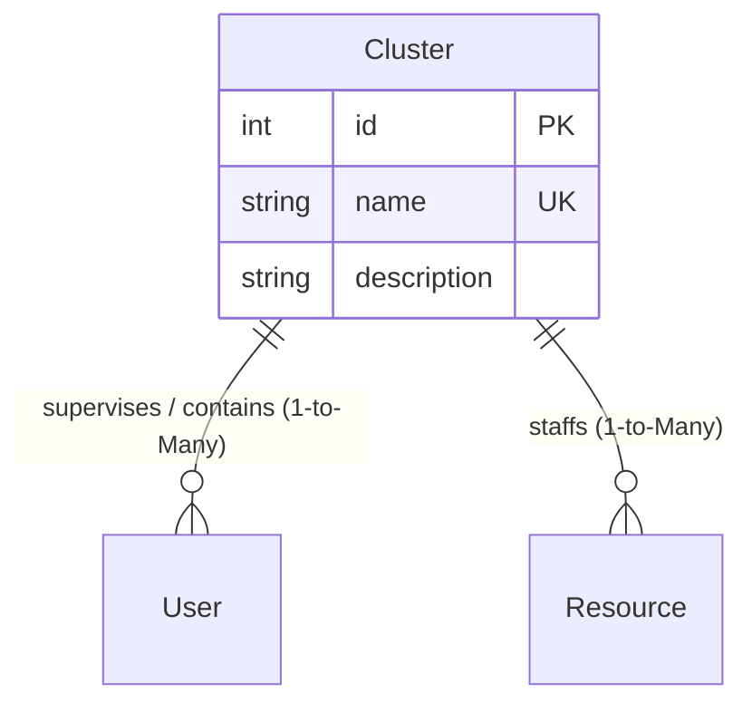

# Cluster Model (`cluster.py`)

## 1. Overview & Purpose

The [cluster.py](file:///Users/kshitijkhandelwal_1/VSCode/ResourcePortal/ResourcePortal/src/resourceportal/models/cluster.py) file defines the [`Cluster`](file:///Users/kshitijkhandelwal_1/VSCode/ResourcePortal/ResourcePortal/src/resourceportal/models/cluster.py#L7-L16) database model for the ResourcePortal backend.

### Why Does This File Exist?
In modern technology and consulting companies, employees are rarely grouped into one flat pool. Instead, they are organized into specialized units such as:
- **Practice Areas** (e.g., "Cloud & DevOps", "Data Engineering", "Cybersecurity", "UI/UX")
- **Business Units** or **Service Delivery Pods**

The [`Cluster`](file:///Users/kshitijkhandelwal_1/VSCode/ResourcePortal/ResourcePortal/src/resourceportal/models/cluster.py#L7-L16) model represents these organizational groupings. It acts as a parent container that ties together:
1. **Management / Portal Users**: Managers or administrators assigned to supervise that specific practice unit.
2. **Resources / Personnel**: The engineers, consultants, and developers working within that unit.

### Real-World Analogy
> [!NOTE]
> Think of a [`Cluster`](file:///Users/kshitijkhandelwal_1/VSCode/ResourcePortal/ResourcePortal/src/resourceportal/models/cluster.py#L7-L16) as an **Academic Department** in a university (e.g., "Department of Computer Science"):
> - The department has **faculty leaders / department heads** ([`User`](file:///Users/kshitijkhandelwal_1/VSCode/ResourcePortal/ResourcePortal/src/resourceportal/models/user.py#L6-L20) accounts with manager permissions).
> - The department has **researchers and students** ([`Resource`](file:///Users/kshitijkhandelwal_1/VSCode/ResourcePortal/ResourcePortal/src/resourceportal/models/resource.py#L9-L35) profiles).
> - Anyone looking for database specialists or cloud engineers goes directly to that department's door.

---

## 2. Architecture & Entity Relationships

The [`Cluster`](file:///Users/kshitijkhandelwal_1/VSCode/ResourcePortal/ResourcePortal/src/resourceportal/models/cluster.py#L7-L16) model serves as an organizational parent entity with two **One-to-Many** branches:



---

## 3. Module Imports Explained

```python
from sqlalchemy import Column, Integer, String
from sqlalchemy.orm import relationship

from resourceportal.database.database import Base
```

| Import | Origin | Why It's Needed |
| :--- | :--- | :--- |
| `Column` | `sqlalchemy` | Used to define each field in the database table. |
| `Integer` | `sqlalchemy` | SQL integer type used for the table's primary key (`id`). |
| `String` | `sqlalchemy` | SQL text type used for the cluster's name and descriptive text. |
| `relationship` | `sqlalchemy.orm` | High-level ORM property that connects clusters to lists of users and resources. |
| `Base` | [`resourceportal.database.database`](file:///Users/kshitijkhandelwal_1/VSCode/ResourcePortal/ResourcePortal/src/resourceportal/database/database.py#L12) | The Declarative Base class providing ORM mapping capabilities. |

---

## 4. Class Definition: [`Cluster`](file:///Users/kshitijkhandelwal_1/VSCode/ResourcePortal/ResourcePortal/src/resourceportal/models/cluster.py#L7-L16)

```python
class Cluster(Base):
    __tablename__ = "clusters"
```

- **`__tablename__ = "clusters"`**: Directs SQLAlchemy to map instances of this class to the `"clusters"` table in the relational database.

### Table Columns & Attributes

| Field Name | Type | Constraints & Defaults | Plain English Explanation & Purpose |
| :--- | :--- | :--- | :--- |
| `id` | `Integer` | `primary_key=True`, `index=True` | Unique numeric identifier for the cluster record. Automatically increments as new clusters are created. |
| `name` | `String` | `unique=True`, `index=True`, `nullable=False` | The name of the cluster (e.g., `"Cloud & Platform Engineering"`). Must be unique and non-empty so that no two clusters share the same name. Indexed for rapid search. |
| `description` | `String` | `nullable=True` | Optional descriptive summary of the cluster's objectives, competencies, or business focus. Can be left empty (`None`). |

---

## 5. Relationships & Navigation

```python
users = relationship("User", back_populates="cluster")
resources = relationship("Resource", back_populates="cluster")
```

### 1. `users` (One-to-Many)
- **Target Model**: [`User`](file:///Users/kshitijkhandelwal_1/VSCode/ResourcePortal/ResourcePortal/src/resourceportal/models/user.py#L6-L20)
- **What it does**: Returns a list of all [`User`](file:///Users/kshitijkhandelwal_1/VSCode/ResourcePortal/ResourcePortal/src/resourceportal/models/user.py#L6-L20) records that have their `cluster_id` set to this cluster's `id`.
- **`back_populates="cluster"`**: Mirrors the `cluster` relationship on the [`User`](file:///Users/kshitijkhandelwal_1/VSCode/ResourcePortal/ResourcePortal/src/resourceportal/models/user.py#L18) class. When a user's cluster is modified, both sides stay in sync in memory.

### 2. `resources` (One-to-Many)
- **Target Model**: [`Resource`](file:///Users/kshitijkhandelwal_1/VSCode/ResourcePortal/ResourcePortal/src/resourceportal/models/resource.py#L9-L35)
- **What it does**: Returns a list of all [`Resource`](file:///Users/kshitijkhandelwal_1/VSCode/ResourcePortal/ResourcePortal/src/resourceportal/models/resource.py#L9-L35) records that belong to this cluster (matching `Resource.cluster_id`).
- **`back_populates="cluster"`**: Mirrors the `cluster` relationship on [`Resource`](file:///Users/kshitijkhandelwal_1/VSCode/ResourcePortal/ResourcePortal/src/resourceportal/models/resource.py#L27).

---

## 6. How It Works in Practice

```python
from resourceportal.models.cluster import Cluster

# Query a cluster by name
cloud_cluster = session.query(Cluster).filter_by(name="Cloud Engineering").first()

print(f"Cluster: {cloud_cluster.name}")
print(f"Description: {cloud_cluster.description}")

# Access all personnel in this cluster directly
print(f"Total engineers in cluster: {len(cloud_cluster.resources)}")
for resource in cloud_cluster.resources:
    print(f"- {resource.name} ({resource.designation})")

# Access all admin/manager accounts assigned to this cluster
for user in cloud_cluster.users:
    print(f"- Manager: {user.username} ({user.email})")
```

---

## 7. Key Concepts Explained for Beginners

### The One-to-Many (1:N) Relationship Pattern
> [!TIP]
> **Analogy**: Think of a mother and her children:
> - One mother can have many children.
> - Each child has only one biological mother.
> 
> In database terms:
> - The [`Cluster`](file:///Users/kshitijkhandelwal_1/VSCode/ResourcePortal/ResourcePortal/src/resourceportal/models/cluster.py#L7-L16) is the **One** side (the parent).
> - The [`Resource`](file:///Users/kshitijkhandelwal_1/VSCode/ResourcePortal/ResourcePortal/src/resourceportal/models/resource.py#L9-L35) is the **Many** side (the children).
> - The **Many** side holds the foreign key (`Resource.cluster_id`), pointing back to the parent's `id`.

### Bidirectional Synchronization with `back_populates`
When you define `back_populates="cluster"` on [`Cluster`](file:///Users/kshitijkhandelwal_1/VSCode/ResourcePortal/ResourcePortal/src/resourceportal/models/cluster.py#L14-L15) and `back_populates="users"` on [`User`](file:///Users/kshitijkhandelwal_1/VSCode/ResourcePortal/ResourcePortal/src/resourceportal/models/user.py#L18), SQLAlchemy keeps both sides perfectly synchronized:
- If you append `new_user` into `cluster.users.append(new_user)`, SQLAlchemy automatically sets `new_user.cluster = cluster`.
- If you change `new_user.cluster = other_cluster`, SQLAlchemy removes `new_user` from the old cluster's list and places it into `other_cluster.users`.
