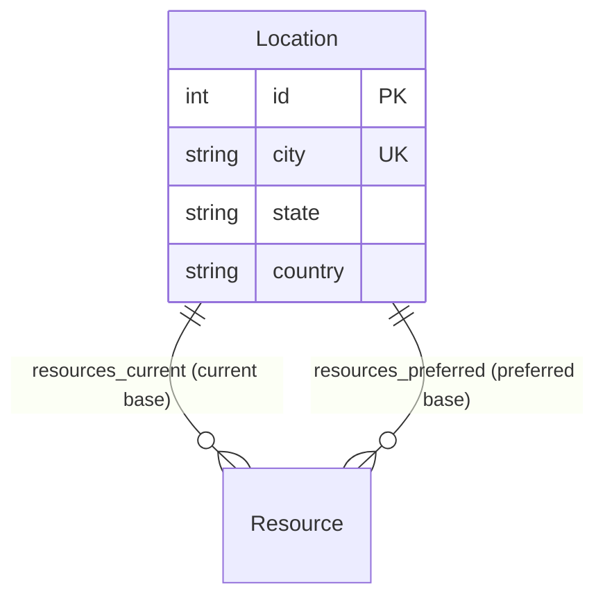

# Location Model (`location.py`)

## 1. Overview & Purpose

The [location.py](file:///Users/kshitijkhandelwal_1/VSCode/ResourcePortal/ResourcePortal/src/resourceportal/models/location.py) file defines the [`Location`](file:///Users/kshitijkhandelwal_1/VSCode/ResourcePortal/ResourcePortal/src/resourceportal/models/location.py#L7-L17) database model for the ResourcePortal backend.

### Why Does This File Exist?
In an enterprise resource portal, managing physical or regional assignments is critical:
- Project staffing requires knowing where an engineer is **currently stationed** for local client engagements or time-zone matching.
- Talent retention and mobility requires knowing where an engineer **prefers to work** if they are seeking relocation.

Rather than letting users type free-form city names into employee records (which leads to inconsistencies like `"NYC"`, `"New York"`, `"new york city"`, and typos), the system maintains a normalized master list of approved office locations.

### Real-World Analogy
> [!NOTE]
> Think of a [`Location`](file:///Users/kshitijkhandelwal_1/VSCode/ResourcePortal/ResourcePortal/src/resourceportal/models/location.py#L7-L17) as an **Airport Hub / Station Code** on a transit map:
> - Every hub has an exact city, state, and country.
> - An employee has a **current station** where their badge works today.
> - They also have a **dream destination station** on their transfer wishlist.

---

## 2. Architecture & Entity Relationships

The [`Location`](file:///Users/kshitijkhandelwal_1/VSCode/ResourcePortal/ResourcePortal/src/resourceportal/models/location.py#L7-L17) model has a unique dual relationship with [`Resource`](file:///Users/kshitijkhandelwal_1/VSCode/ResourcePortal/ResourcePortal/src/resourceportal/models/resource.py#L9-L35):



---

## 3. Module Imports Explained

```python
from sqlalchemy import Column, Integer, String
from sqlalchemy.orm import relationship

from resourceportal.database.database import Base
```

| Import | Origin | Why It's Needed |
| :--- | :--- | :--- |
| `Column` | `sqlalchemy` | Defines fields within the database table. |
| `Integer` | `sqlalchemy` | SQL integer type used for the primary key (`id`). |
| `String` | `sqlalchemy` | SQL string type for geographical names (`city`, `state`, `country`). |
| `relationship` | `sqlalchemy.orm` | High-level ORM tool to connect the location to the resources currently or preferentially located there. |
| `Base` | [`resourceportal.database.database`](file:///Users/kshitijkhandelwal_1/VSCode/ResourcePortal/ResourcePortal/src/resourceportal/database/database.py#L12) | Declarative Base class that registers the table schema in SQLAlchemy. |

---

## 4. Class Definition: [`Location`](file:///Users/kshitijkhandelwal_1/VSCode/ResourcePortal/ResourcePortal/src/resourceportal/models/location.py#L7-L17)

```python
class Location(Base):
    __tablename__ = "locations"
```

- **`__tablename__ = "locations"`**: Maps the Python class to the relational table named `"locations"`.

### Table Columns & Attributes

| Field Name | Type | Constraints & Defaults | Plain English Explanation & Purpose |
| :--- | :--- | :--- | :--- |
| `id` | `Integer` | `primary_key=True`, `index=True` | Unique database identifier for this location record. |
| `city` | `String` | `unique=True`, `index=True`, `nullable=False` | The official name of the city (e.g., `"Seattle"`, `"London"`, `"Bangalore"`). Must be unique to prevent duplicate city entries. Indexed for fast lookup. |
| `state` | `String` | `nullable=False` | The state, province, or administrative territory (e.g., `"Washington"`, `"Karnataka"`). Cannot be null. |
| `country` | `String` | `nullable=False` | The country of the office (e.g., `"United States"`, `"India"`, `"United Kingdom"`). Cannot be null. |

---

## 5. Relationships & Dual Links

```python
resources_current = relationship("Resource", foreign_keys="[Resource.current_location_id]", back_populates="current_location")
resources_preferred = relationship("Resource", foreign_keys="[Resource.preferred_location_id]", back_populates="preferred_location")
```

### Why Are There Two Relationships to the Same Model?
The [`Resource`](file:///Users/kshitijkhandelwal_1/VSCode/ResourcePortal/ResourcePortal/src/resourceportal/models/resource.py#L9-L35) model contains two separate location foreign keys:
1. `current_location_id`: Where the person works today.
2. `preferred_location_id`: Where the person would like to work in the future.

Therefore, from the perspective of a [`Location`](file:///Users/kshitijkhandelwal_1/VSCode/ResourcePortal/ResourcePortal/src/resourceportal/models/location.py#L7-L17), there are two distinct lists of employees:
- **`resources_current`**: All resources whose *current* location is this office.
- **`resources_preferred`**: All resources whose *preferred* relocation destination is this office.

### Why String Syntax in `foreign_keys="[Resource.current_location_id]"`?
Notice the quotes around `"[Resource.current_location_id]"`. This is an essential SQLAlchemy feature:
- In Python, if `location.py` imports `resource.py`, and `resource.py` imports `location.py`, you get a **circular import error** that crashes your app.
- By putting the expression inside quotes as a string, SQLAlchemy **defers evaluation** until all model classes have been loaded into memory. This eliminates circular import issues entirely.

---

## 6. How It Works in Practice

```python
from resourceportal.models.location import Location

# Query a location by city name
london_office = session.query(Location).filter_by(city="London").first()

print(f"Office: {london_office.city}, {london_office.state}, {london_office.country}")

# 1. See who is currently working in London
print(f"Currently stationed in London ({len(london_office.resources_current)}):")
for res in london_office.resources_current:
    print(f"- {res.name} ({res.designation})")

# 2. See who wants to relocate to London
print(f"Desire relocation to London ({len(london_office.resources_preferred)}):")
for res in london_office.resources_preferred:
    print(f"- {res.name} (Currently in: {res.current_location.city})")
```

---

## 7. Key Concepts Explained for Beginners

### Database Normalization
> [!TIP]
> **Why not just store a string `"city"` inside the `resources` table?**
> If you have 500 employees in New York, and you store `"New York"` as raw text on every row:
> 1. Typographical errors (`"New York"`, `"new york"`, `"NewYork"`, `"NY"`) break searches and analytics.
> 2. If the company updates office details, you would have to update 500 separate rows.
> 
> With **normalization**, you store the city once in the `locations` table with ID `1`. All 500 employees simply store `current_location_id = 1`.

### Resolving Multi-Path Relationships
When two entities are linked by more than one path (current office vs. preferred office), the database needs distinct foreign keys, and SQLAlchemy requires explicit `foreign_keys` pointers to identify which column corresponds to which Python property.
