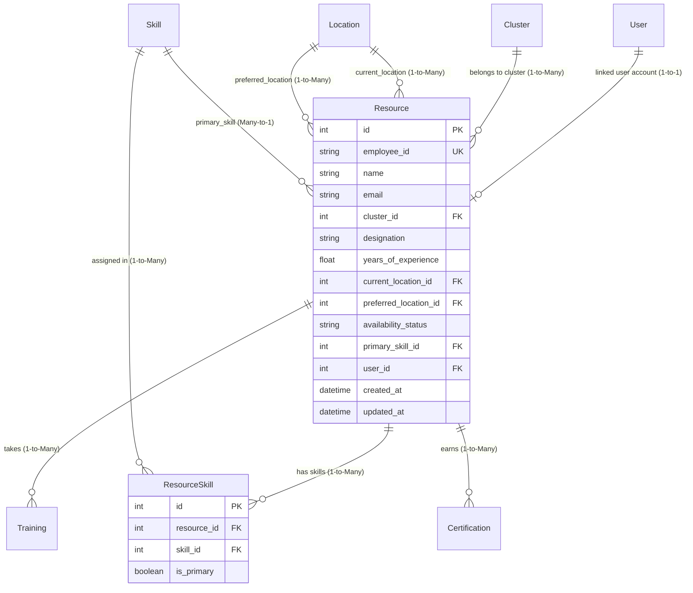

# Resource Models (`resource.py`)

## 1. Overview & Purpose

The [resource.py](file:///Users/kshitijkhandelwal_1/VSCode/ResourcePortal/ResourcePortal/src/resourceportal/models/resource.py) file defines two core database models:
1. [`Resource`](file:///Users/kshitijkhandelwal_1/VSCode/ResourcePortal/ResourcePortal/src/resourceportal/models/resource.py#L9-L35): The central entity of the entire application, representing an employee or professional resource within the organization.
2. [`ResourceSkill`](file:///Users/kshitijkhandelwal_1/VSCode/ResourcePortal/ResourcePortal/src/resourceportal/models/resource.py#L37-L47): An association model (junction table) that connects resources to the skills they possess.

### Why Does This File Exist?
At the heart of the ResourcePortal is the need to track, search, allocate, and upskill talent. Organizations need to answer questions like:
- *"Who is available to work on a new client project immediately?"*
- *"Which engineers with 3+ years of experience in Python are currently located in New York or prefer relocating there?"*
- *"What certifications and trainings has an employee completed?"*

This file captures complete employee profiles, their locations, availability, competencies, and organizational hierarchy.

### Real-World Analogy
> [!NOTE]
> Think of [`Resource`](file:///Users/kshitijkhandelwal_1/VSCode/ResourcePortal/ResourcePortal/src/resourceportal/models/resource.py#L9-L35) as a **Comprehensive Employee Master Dossier**:
> - It holds their official identity (employee ID, designation, experience).
> - It records where they currently sit and where they wish to move (current & preferred office branch).
> - It links to their **Skills Passport** ([`ResourceSkill`](file:///Users/kshitijkhandelwal_1/VSCode/ResourcePortal/ResourcePortal/src/resourceportal/models/resource.py#L37-L47)), which contains stamps for every tool and language they know, highlighting which one is their primary specialty.

---

## 2. Architecture & Entity Relationships

The [`Resource`](file:///Users/kshitijkhandelwal_1/VSCode/ResourcePortal/ResourcePortal/src/resourceportal/models/resource.py#L9-L35) model is the hub of the entire schema:



---

## 3. Module Imports Explained

```python
import datetime

from sqlalchemy import Boolean, Column, DateTime, Float, ForeignKey, Integer, String
from sqlalchemy.orm import relationship

from resourceportal.database.database import Base
```

| Import | Origin | Why It's Needed |
| :--- | :--- | :--- |
| `datetime` | Python standard library | Used for timestamp generation and automated updates on record changes. |
| `Boolean` | `sqlalchemy` | SQL boolean type used in `ResourceSkill.is_primary` to flag main skills. |
| `Column` | `sqlalchemy` | Constructs table columns. |
| `DateTime` | `sqlalchemy` | Stores dates with timestamps (`created_at`, `updated_at`). |
| `Float` | `sqlalchemy` | Stores floating-point decimal numbers (`years_of_experience`, e.g., 3.5 years). |
| `ForeignKey` | `sqlalchemy` | Enforces relational links between tables (referencing `clusters.id`, `locations.id`, `skills.id`, `users.id`, `resources.id`). |
| `Integer` | `sqlalchemy` | Stores whole numbers for IDs and foreign keys. |
| `String` | `sqlalchemy` | Stores text values (names, employee IDs, designations, statuses). |
| `relationship` | `sqlalchemy.orm` | Builds object-level links between models for easy Python attribute navigation. |
| `Base` | [`resourceportal.database.database`](file:///Users/kshitijkhandelwal_1/VSCode/ResourcePortal/ResourcePortal/src/resourceportal/database/database.py#L12) | The Declarative Base class from which all models inherit. |

---

## 4. Class Definition: [`Resource`](file:///Users/kshitijkhandelwal_1/VSCode/ResourcePortal/ResourcePortal/src/resourceportal/models/resource.py#L9-L35)

```python
class Resource(Base):
    __tablename__ = "resources"
```

### Table Columns & Attributes

| Field Name | Type | Constraints & Defaults | Plain English Explanation & Purpose |
| :--- | :--- | :--- | :--- |
| `id` | `Integer` | `primary_key=True`, `index=True` | Unique database identifier for this resource record. |
| `employee_id` | `String` | `unique=True`, `index=True`, `nullable=False` | Official company identifier (e.g., `"EMP10042"`). Must be unique across the organization. Indexed for fast lookup. |
| `name` | `String` | `nullable=False` | Full name of the employee (e.g., `"Jane Smith"`). Cannot be empty. |
| `email` | `String` | `nullable=False` | Corporate email address of the employee. |
| `cluster_id` | `Integer` | `ForeignKey("clusters.id")`, `nullable=False` | Foreign key referencing [`Cluster`](file:///Users/kshitijkhandelwal_1/VSCode/ResourcePortal/ResourcePortal/src/resourceportal/models/cluster.py#L7-L16). Indicates the department or practice group the employee belongs to. |
| `designation` | `String` | `nullable=False` | Job title or level (e.g., `"Staff Engineer"`, `"Consultant"`). |
| `years_of_experience` | `Float` | `nullable=False` | Professional experience measured in years (allows decimals like `4.5`). |
| `current_location_id` | `Integer` | `ForeignKey("locations.id")`, `nullable=False` | Foreign key referencing [`Location`](file:///Users/kshitijkhandelwal_1/VSCode/ResourcePortal/ResourcePortal/src/resourceportal/models/location.py#L7-L17). Where the resource is currently stationed. |
| `preferred_location_id`| `Integer` | `ForeignKey("locations.id")`, `nullable=False` | Foreign key referencing [`Location`](file:///Users/kshitijkhandelwal_1/VSCode/ResourcePortal/ResourcePortal/src/resourceportal/models/location.py#L7-L17). Where the resource prefers to be located or relocate to. |
| `availability_status` | `String` | `nullable=False` | Current bench/project status (e.g., `"Available"`, `"Allocated"`, `"On Leave"`). |
| `primary_skill_id` | `Integer` | `ForeignKey("skills.id")`, `nullable=False` | Foreign key referencing [`Skill`](file:///Users/kshitijkhandelwal_1/VSCode/ResourcePortal/ResourcePortal/src/resourceportal/models/skill.py#L7-L16). Denotes the employee's main technical expertise for quick filtering. |
| `user_id` | `Integer` | `ForeignKey("users.id")`, `nullable=True` | Foreign key referencing [`User`](file:///Users/kshitijkhandelwal_1/VSCode/ResourcePortal/ResourcePortal/src/resourceportal/models/user.py#L6-L20). Optional link if this resource has an active login account. |
| `created_at` | `DateTime` | `default=datetime.datetime.utcnow` | Timestamp when the profile was added. |
| `updated_at` | `DateTime` | `default=datetime.datetime.utcnow`, `onupdate=datetime.datetime.utcnow` | Automatically updates to the current timestamp whenever any column in this row is modified. |

---

## 5. Relationships & Disambiguation

```python
cluster = relationship("Cluster", back_populates="resources")
current_location = relationship("Location", foreign_keys=[current_location_id], back_populates="resources_current")
preferred_location = relationship("Location", foreign_keys=[preferred_location_id], back_populates="resources_preferred")
user = relationship("User", back_populates="resource")
skills = relationship("ResourceSkill", back_populates="resource")
trainings = relationship("Training", back_populates="resource")
certifications = relationship("Certification", back_populates="resource")
primary_skill = relationship("Skill", foreign_keys=[primary_skill_id])
```

### Why Are `foreign_keys=[...]` Explicitly Listed for Locations?
Notice both `current_location_id` and `preferred_location_id` point to the same table: `"locations.id"`. 
Without `foreign_keys=[...]`, SQLAlchemy gets confused: *"You want a relationship to Location, but you have TWO foreign keys pointing to it! Which one should I use to join the tables?"*
Specifying `foreign_keys=[current_location_id]` explicitly instructs SQLAlchemy:
- For `current_location`, join using the `current_location_id` column.
- For `preferred_location`, join using the `preferred_location_id` column.

### Relationship Breakdown

1. **`cluster` (Many-to-One)**: Links to the [`Cluster`](file:///Users/kshitijkhandelwal_1/VSCode/ResourcePortal/ResourcePortal/src/resourceportal/models/cluster.py#L7-L16) this resource belongs to.
2. **`current_location` (Many-to-One)**: Links to the [`Location`](file:///Users/kshitijkhandelwal_1/VSCode/ResourcePortal/ResourcePortal/src/resourceportal/models/location.py#L7-L17) object representing current base office.
3. **`preferred_location` (Many-to-One)**: Links to the [`Location`](file:///Users/kshitijkhandelwal_1/VSCode/ResourcePortal/ResourcePortal/src/resourceportal/models/location.py#L7-L17) object representing preferred office.
4. **`user` (One-to-One)**: Links to the corresponding portal [`User`](file:///Users/kshitijkhandelwal_1/VSCode/ResourcePortal/ResourcePortal/src/resourceportal/models/user.py#L6-L20) account.
5. **`skills` (One-to-Many to Association)**: Returns a list of [`ResourceSkill`](file:///Users/kshitijkhandelwal_1/VSCode/ResourcePortal/ResourcePortal/src/resourceportal/models/resource.py#L37-L47) junction objects.
6. **`trainings` (One-to-Many)**: Returns a list of [`Training`](file:///Users/kshitijkhandelwal_1/VSCode/ResourcePortal/ResourcePortal/src/resourceportal/models/training.py#L5-L19) sessions assigned to or completed by this person.
7. **`certifications` (One-to-Many)**: Returns a list of [`Certification`](file:///Users/kshitijkhandelwal_1/VSCode/ResourcePortal/ResourcePortal/src/resourceportal/models/certification.py#L7-L18) records earned by this person.
8. **`primary_skill` (Many-to-One)**: Direct link to the primary [`Skill`](file:///Users/kshitijkhandelwal_1/VSCode/ResourcePortal/ResourcePortal/src/resourceportal/models/skill.py#L7-L16) object.

---

## 6. Class Definition: [`ResourceSkill`](file:///Users/kshitijkhandelwal_1/VSCode/ResourcePortal/ResourcePortal/src/resourceportal/models/resource.py#L37-L47) (Association Model)

```python
class ResourceSkill(Base):
    __tablename__ = "resource_skills"

    id = Column(Integer, primary_key=True, index=True)
    resource_id = Column(Integer, ForeignKey("resources.id"), nullable=False)
    skill_id = Column(Integer, ForeignKey("skills.id"), nullable=False)
    is_primary = Column(Boolean, default=False)

    resource = relationship("Resource", back_populates="skills")
    skill = relationship("Skill", back_populates="resource_skills")
```

### Why Do We Need an Association Model?
In real life:
- One resource knows **many skills** (e.g., Python, Docker, SQL).
- One skill is known by **many resources** (e.g., 20 different engineers know Python).

This is a classic **Many-to-Many** relationship. In a relational database, you cannot put a list of IDs into a single cell. Instead, we use an **Association Table** (also called a *Junction* or *Bridge* table).

Furthermore, because we want to attach extra metadata to the link itself—namely `is_primary` (whether this specific skill is this resource's primary competency)—we define [`ResourceSkill`](file:///Users/kshitijkhandelwal_1/VSCode/ResourcePortal/ResourcePortal/src/resourceportal/models/resource.py#L37-L47) as a full declarative model rather than a simple table.

### Columns in `ResourceSkill`:
- **`id`**: Primary key for the junction row.
- **`resource_id`**: Foreign key pointing to `resources.id`.
- **`skill_id`**: Foreign key pointing to `skills.id`.
- **`is_primary`**: Boolean flag indicating if this skill is the employee's main specialization.

---

## 7. How It Works in Practice

```python
from resourceportal.models.resource import Resource, ResourceSkill

# Query a resource and traverse relationships
resource = session.query(Resource).filter_by(employee_id="EMP10042").first()

print(f"Name: {resource.name}")
print(f"Current Office: {resource.current_location.city}")
print(f"Preferred Office: {resource.preferred_location.city}")
print(f"Primary Skill: {resource.primary_skill.name}")

# List all skills through the association model
for res_skill in resource.skills:
    print(f"- Skill: {res_skill.skill.name}, Is Primary: {res_skill.is_primary}")

# Check certifications
for cert in resource.certifications:
    print(f"- Certified: {cert.name} ({cert.issuing_organization})")
```

---

## 8. Key Concepts Explained for Beginners

### Junction / Association Table Pattern
> [!TIP]
> **Analogy**: Think of a university course enrollment system:
> - One student takes multiple courses.
> - One course is taken by multiple students.
> 
> You cannot store the course list inside the student card, nor all student names in a single course box. You create an **Enrollment Card** (the junction row) that says: `Student 5 is enrolled in Course 10, and their grade/status is 'A'`. 
> That is exactly what [`ResourceSkill`](file:///Users/kshitijkhandelwal_1/VSCode/ResourcePortal/ResourcePortal/src/resourceportal/models/resource.py#L37-L47) does for resources and skills.

### Resolving Ambiguous Foreign Keys (`foreign_keys=[...]`)
When a table has two columns pointing to the same foreign table (such as `current_location_id` and `preferred_location_id` both referencing `locations.id`), SQLAlchemy cannot guess which column links to which relationship. Passing `foreign_keys=[column_name]` tells SQLAlchemy explicitly which column to use for the SQL join.

### Automatic Timestamping with `onupdate`
- `default=datetime.datetime.utcnow`: Only runs when a row is first inserted.
- `onupdate=datetime.datetime.utcnow`: Triggers automatically whenever any field in an existing row is modified, keeping an accurate audit trail of edits.
