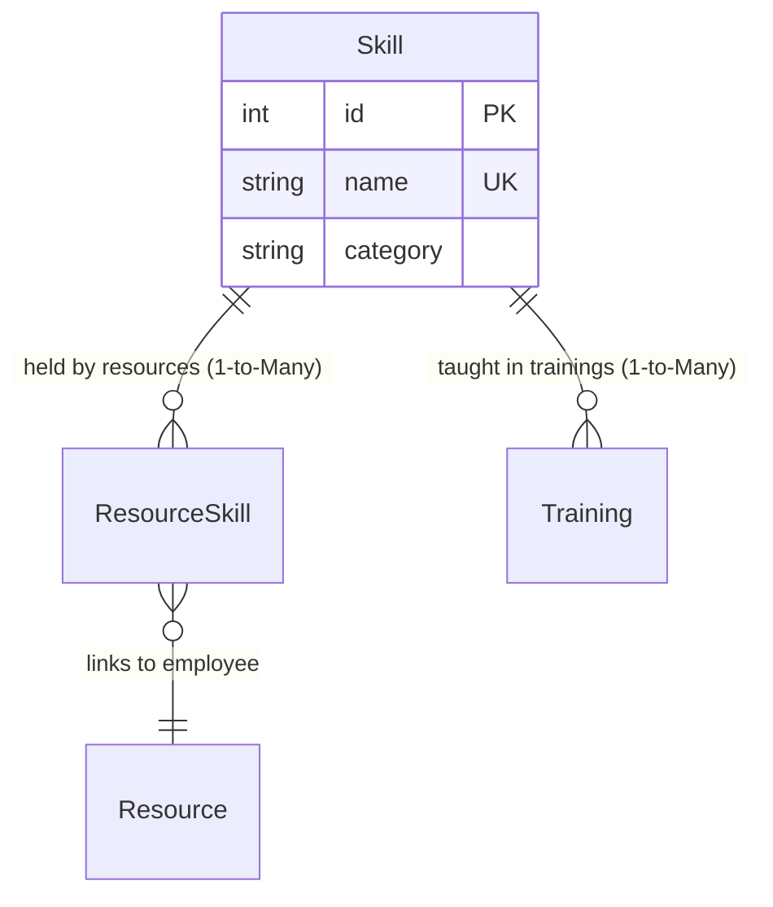

# Skill Model (`skill.py`)

## 1. Overview & Purpose

The [skill.py](file:///Users/kshitijkhandelwal_1/VSCode/ResourcePortal/ResourcePortal/src/resourceportal/models/skill.py) file defines the [`Skill`](file:///Users/kshitijkhandelwal_1/VSCode/ResourcePortal/ResourcePortal/src/resourceportal/models/skill.py#L7-L16) database model for the ResourcePortal backend.

### Why Does This File Exist?
A resource management portal needs to track technical capabilities with precision. In this application:
- Employees have technical skills (e.g., Python, Docker, React, AWS).
- Project managers search for people who have specific skills to staff open client demands.
- HR and team leads organize training programs targeting specific skill gaps.

The [`Skill`](file:///Users/kshitijkhandelwal_1/VSCode/ResourcePortal/ResourcePortal/src/resourceportal/models/skill.py#L7-L16) model provides a single, controlled catalog of all recognized technical proficiencies across the company, grouped into categories.

### Real-World Analogy
> [!NOTE]
> Think of a [`Skill`](file:///Users/kshitijkhandelwal_1/VSCode/ResourcePortal/ResourcePortal/src/resourceportal/models/skill.py#L7-L16) as an **Achievement Badge in a Video Game**:
> - The game catalog has distinct badges: `"Python Specialist"`, `"Docker Practitioner"`, `"React Architect"`.
> - Each badge belongs to a skill tree / category (`"Backend"`, `"DevOps"`, `"Frontend"`).
> - Multiple players can earn the badge, and a player can earn multiple badges.
> - Guilds offer training quests specifically designed to help players unlock a badge.

---

## 2. Architecture & Entity Relationships

The [`Skill`](file:///Users/kshitijkhandelwal_1/VSCode/ResourcePortal/ResourcePortal/src/resourceportal/models/skill.py#L7-L16) model links to employees via [`ResourceSkill`](file:///Users/kshitijkhandelwal_1/VSCode/ResourcePortal/ResourcePortal/src/resourceportal/models/resource.py#L37-L47) and to learning programs via [`Training`](file:///Users/kshitijkhandelwal_1/VSCode/ResourcePortal/ResourcePortal/src/resourceportal/models/training.py#L5-L19):



---

## 3. Module Imports Explained

```python
from sqlalchemy import Column, Integer, String
from sqlalchemy.orm import relationship

from resourceportal.database.database import Base
```

| Import | Origin | Why It's Needed |
| :--- | :--- | :--- |
| `Column` | `sqlalchemy` | Creates columns in the database table schema. |
| `Integer` | `sqlalchemy` | SQL integer type used for the primary key (`id`). |
| `String` | `sqlalchemy` | SQL varchar type used for text values (`name` and `category`). |
| `relationship` | `sqlalchemy.orm` | Builds object-level navigation to linked records in `resource_skills` and `training`. |
| `Base` | [`resourceportal.database.database`](file:///Users/kshitijkhandelwal_1/VSCode/ResourcePortal/ResourcePortal/src/resourceportal/database/database.py#L12) | Declarative Base registry for SQLAlchemy ORM mapping. |

---

## 4. Class Definition: [`Skill`](file:///Users/kshitijkhandelwal_1/VSCode/ResourcePortal/ResourcePortal/src/resourceportal/models/skill.py#L7-L16)

```python
class Skill(Base):
    __tablename__ = "skills"
```

- **`__tablename__ = "skills"`**: Specifies the database table name where skill records are stored.

### Table Columns & Attributes

| Field Name | Type | Constraints & Defaults | Plain English Explanation & Purpose |
| :--- | :--- | :--- | :--- |
| `id` | `Integer` | `primary_key=True`, `index=True` | Unique database identifier for each skill. |
| `name` | `String` | `unique=True`, `index=True`, `nullable=False` | The name of the technology or skill (e.g., `"FastAPI"`, `"PostgreSQL"`, `"Terraform"`). Must be unique to prevent duplicate definitions. Indexed for rapid search. |
| `category` | `String` | `nullable=False` | The broader domain the skill belongs to (e.g., `"Backend"`, `"Frontend"`, `"DevOps"`, `"Database"`, `"QA"`). Helps in grouped reporting and filtering. |

---

## 5. Relationships & Navigation

```python
resource_skills = relationship("ResourceSkill", back_populates="skill")
trainings = relationship("Training", back_populates="skill")
```

### 1. `resource_skills` (One-to-Many to Association Model)
- **Target Model**: [`ResourceSkill`](file:///Users/kshitijkhandelwal_1/VSCode/ResourcePortal/ResourcePortal/src/resourceportal/models/resource.py#L37-L47)
- **What it does**: Returns all junction rows where this skill is linked to an employee.
- **How to reach resources**: By iterating through `skill.resource_skills`, you can reach the actual employees: `item.resource`.
- **`back_populates="skill"`**: Synchronizes with the `skill` attribute on [`ResourceSkill`](file:///Users/kshitijkhandelwal_1/VSCode/ResourcePortal/ResourcePortal/src/resourceportal/models/resource.py#L46).

### 2. `trainings` (One-to-Many)
- **Target Model**: [`Training`](file:///Users/kshitijkhandelwal_1/VSCode/ResourcePortal/ResourcePortal/src/resourceportal/models/training.py#L5-L19)
- **What it does**: Returns a list of all training courses or workshops in the portal designed to teach this skill.
- **`back_populates="skill"`**: Synchronizes with the `skill` attribute on [`Training`](file:///Users/kshitijkhandelwal_1/VSCode/ResourcePortal/ResourcePortal/src/resourceportal/models/training.py#L18).

---

## 6. How It Works in Practice

```python
from resourceportal.models.skill import Skill

# Find the "FastAPI" skill
fastapi = session.query(Skill).filter_by(name="FastAPI").first()

print(f"Skill: {fastapi.name} (Category: {fastapi.category})")

# 1. Discover all developers possessing this skill
print(f"Engineers skilled in {fastapi.name}:")
for res_skill in fastapi.resource_skills:
    primary_tag = " (Primary)" if res_skill.is_primary else ""
    print(f"- {res_skill.resource.name}{primary_tag}")

# 2. Discover available trainings for this skill
print(f"Active training courses for {fastapi.name}:")
for course in fastapi.trainings:
    print(f"- {course.training_name} [Status: {course.status}]")
```

---

## 7. Key Concepts Explained for Beginners

### Controlled Vocabularies vs. Free Text
If you let users type their skills freely, you will end up with `"py"`, `"python"`, `"Python3"`, `"Python 3.11"`, and `"pyton"`. It becomes impossible to accurately query: *"Who knows Python?"*
By storing skills in a dedicated [`Skill`](file:///Users/kshitijkhandelwal_1/VSCode/ResourcePortal/ResourcePortal/src/resourceportal/models/skill.py#L7-L16) table with `unique=True`, the application guarantees a **controlled vocabulary**. Users select from approved skills.

### Bridging Skills to Learning & Development
Notice that [`Skill`](file:///Users/kshitijkhandelwal_1/VSCode/ResourcePortal/ResourcePortal/src/resourceportal/models/skill.py#L7-L16) is not an isolated dictionary—it links directly into [`Training`](file:///Users/kshitijkhandelwal_1/VSCode/ResourcePortal/ResourcePortal/src/resourceportal/models/training.py#L5-L19). If an employee needs to learn Docker for a project, the system can immediately find all trainings where `skill_id` matches Docker's ID.
