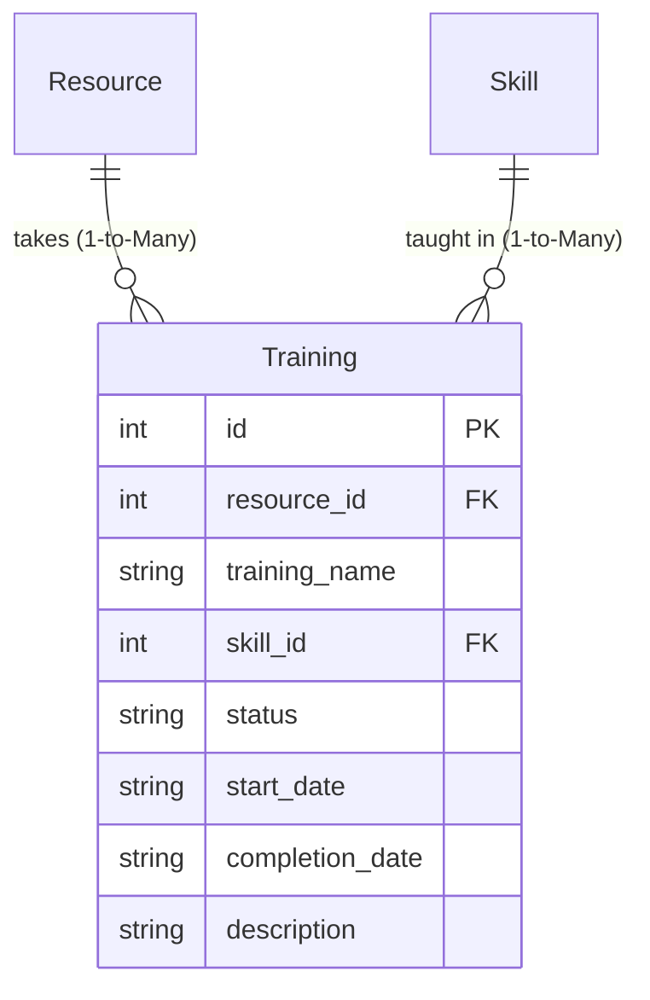

# Training Model (`training.py`)

## 1. Overview & Purpose

The [training.py](file:///Users/kshitijkhandelwal_1/VSCode/ResourcePortal/ResourcePortal/src/resourceportal/models/training.py) file defines the [`Training`](file:///Users/kshitijkhandelwal_1/VSCode/ResourcePortal/ResourcePortal/src/resourceportal/models/training.py#L5-L19) database model for the ResourcePortal backend.

### Why Does This File Exist?
In technology organizations, continuous learning and upskilling are essential. When employees are between client projects (on the "bench") or preparing for upcoming project demands, they enroll in training courses. 

The [`Training`](file:///Users/kshitijkhandelwal_1/VSCode/ResourcePortal/ResourcePortal/src/resourceportal/models/training.py#L5-L19) model tracks:
- **Who is being trained**: The specific employee ([`Resource`](file:///Users/kshitijkhandelwal_1/VSCode/ResourcePortal/ResourcePortal/src/resourceportal/models/resource.py#L9-L35)).
- **What is being learned**: The course name and target technical capability ([`Skill`](file:///Users/kshitijkhandelwal_1/VSCode/ResourcePortal/ResourcePortal/src/resourceportal/models/skill.py#L7-L16)).
- **Progress & timeline**: The current status (`Planned`, `In Progress`, `Completed`) and schedule dates.

### Real-World Analogy
> [!NOTE]
> Think of a [`Training`](file:///Users/kshitijkhandelwal_1/VSCode/ResourcePortal/ResourcePortal/src/resourceportal/models/training.py#L5-L19) record as a **Course Enrollment & Progress Card**:
> - It bears the student's name ([`Resource`](file:///Users/kshitijkhandelwal_1/VSCode/ResourcePortal/ResourcePortal/src/resourceportal/models/resource.py#L9-L35)).
> - It specifies the subject being mastered ([`Skill`](file:///Users/kshitijkhandelwal_1/VSCode/ResourcePortal/ResourcePortal/src/resourceportal/models/skill.py#L7-L16)).
> - It contains progress checkboxes: enrolled, started, and graduated.

---

## 2. Architecture & Entity Relationships

The [`Training`](file:///Users/kshitijkhandelwal_1/VSCode/ResourcePortal/ResourcePortal/src/resourceportal/models/training.py#L5-L19) model connects an employee to an optional technical skill:



---

## 3. Module Imports Explained

```python
from sqlalchemy import Column, Integer, String, ForeignKey
from sqlalchemy.orm import relationship
from resourceportal.database.database import Base
```

| Import | Origin | Why It's Needed |
| :--- | :--- | :--- |
| `Column` | `sqlalchemy` | Creates columns in the database table schema. |
| `Integer` | `sqlalchemy` | Used for primary keys (`id`) and foreign keys (`resource_id`, `skill_id`). |
| `String` | `sqlalchemy` | Used for text fields (`training_name`, `status`, `start_date`, `completion_date`, `description`). |
| `ForeignKey` | `sqlalchemy` | Connects rows in this table to parents in `resources` and `skills`. |
| `relationship` | `sqlalchemy.orm` | Provides Python object properties to access the related `Resource` and `Skill`. |
| `Base` | [`resourceportal.database.database`](file:///Users/kshitijkhandelwal_1/VSCode/ResourcePortal/ResourcePortal/src/resourceportal/database/database.py#L12) | The Declarative Base registry class. |

---

## 4. Class Definition: [`Training`](file:///Users/kshitijkhandelwal_1/VSCode/ResourcePortal/ResourcePortal/src/resourceportal/models/training.py#L5-L19)

```python
class Training(Base):
    __tablename__ = "training"
```

- **`__tablename__ = "training"`**: Directs SQLAlchemy to map this class to the `"training"` table in SQLite.

### Table Columns & Attributes

| Field Name | Type | Constraints & Defaults | Plain English Explanation & Purpose |
| :--- | :--- | :--- | :--- |
| `id` | `Integer` | `primary_key=True`, `index=True` | Unique database identifier for each training record. |
| `resource_id` | `Integer` | `ForeignKey("resources.id")`, `nullable=False` | Identifies which employee is taking this training. Cannot be null because a training without a trainee makes no sense. |
| `training_name` | `String` | `nullable=False` | The title or curriculum name (e.g., `"AWS Solutions Architect Bootcamp"`). |
| `skill_id` | `Integer` | `ForeignKey("skills.id")`, `nullable=True` | References the specific [`Skill`](file:///Users/kshitijkhandelwal_1/VSCode/ResourcePortal/ResourcePortal/src/resourceportal/models/skill.py#L7-L16) this course targets. Optional (`nullable=True`) because some trainings may be soft skills or multi-disciplinary. |
| `status` | `String` | `nullable=False`, `default="Planned"` | Current state of completion. Automatically defaults to `"Planned"`. Typical values: `"Planned"`, `"In Progress"`, `"Completed"`, `"Cancelled"`. |
| `start_date` | `String` | `nullable=True` | The planned or actual start date (e.g., `"2026-03-15"`). |
| `completion_date` | `String` | `nullable=True` | The date the course was finished. Left empty until the employee completes it. |
| `description` | `String` | `nullable=True` | Optional notes, syllabus link, or course objectives. |

---

## 5. Relationships & Navigation

```python
resource = relationship("Resource", back_populates="trainings")
skill = relationship("Skill", back_populates="trainings")
```

### 1. `resource` (Many-to-One)
- **Target Model**: [`Resource`](file:///Users/kshitijkhandelwal_1/VSCode/ResourcePortal/ResourcePortal/src/resourceportal/models/resource.py#L9-L35)
- **Foreign Key**: `resource_id` points to `resources.id`
- **What it does**: Links directly to the employee taking this course.
- **`back_populates="trainings"`**: Mirrors the `trainings` list on the [`Resource`](file:///Users/kshitijkhandelwal_1/VSCode/ResourcePortal/ResourcePortal/src/resourceportal/models/resource.py#L32) model.

### 2. `skill` (Many-to-One)
- **Target Model**: [`Skill`](file:///Users/kshitijkhandelwal_1/VSCode/ResourcePortal/ResourcePortal/src/resourceportal/models/skill.py#L7-L16)
- **Foreign Key**: `skill_id` points to `skills.id`
- **What it does**: Links to the technical competency being taught.
- **`back_populates="trainings"`**: Mirrors the `trainings` list on [`Skill`](file:///Users/kshitijkhandelwal_1/VSCode/ResourcePortal/ResourcePortal/src/resourceportal/models/skill.py#L15).

---

## 6. How It Works in Practice

```python
from resourceportal.models.training import Training

# Enroll an employee in a training
new_training = Training(
    resource_id=5,
    training_name="Mastering Kubernetes & Helm",
    skill_id=2,  # Kubernetes skill
    status="Planned",
    start_date="2026-04-01"
)
session.add(new_training)
session.commit()

# Update training when completed
training = session.query(Training).filter_by(id=new_training.id).first()
training.status = "Completed"
training.completion_date = "2026-04-20"
session.commit()

print(f"Trainee: {training.resource.name}")
print(f"Target Skill: {training.skill.name if training.skill else 'General'}")
print(f"Status: {training.status}")
```

---

## 7. Key Concepts Explained for Beginners

### Mandatory vs. Optional Foreign Keys
Notice the contrast between `resource_id` and `skill_id`:
- `resource_id`: `nullable=False`. An enrollment **must** belong to a person.
- `skill_id`: `nullable=True`. A training course might be a leadership seminar, agile methodology workshop, or general onboarding that doesn't map to a specific technical coding skill in the catalog.

### Default Values (`default="Planned"`)
Instead of forcing developers to supply `"Planned"` every time an enrollment is created, SQLAlchemy's `default` argument automatically fills in this value if none is provided.
