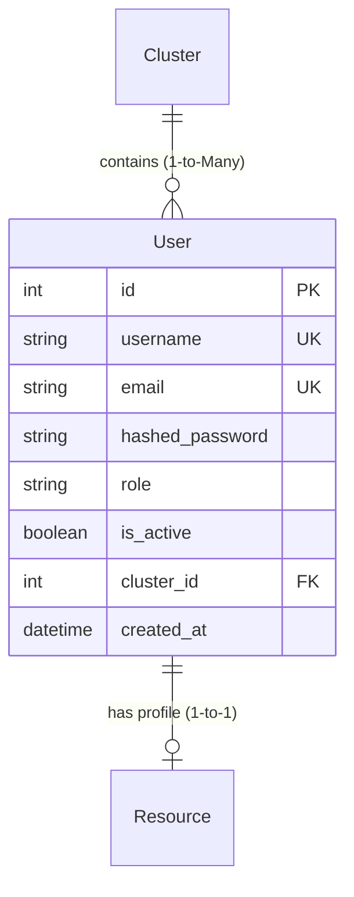

# User Model (`user.py`)

## 1. Overview & Purpose

The [user.py](file:///Users/kshitijkhandelwal_1/VSCode/ResourcePortal/ResourcePortal/src/resourceportal/models/user.py) file defines the [`User`](file:///Users/kshitijkhandelwal_1/VSCode/ResourcePortal/ResourcePortal/src/resourceportal/models/user.py#L6-L20) database model for the ResourcePortal backend.

### Why Does This File Exist?
In any enterprise portal, security and access control are fundamental. Not everyone should have unrestricted access to add, edit, or delete resource data. This file provides the blueprint for storing:
- **Authentication credentials**: Who the user is (username, email) and proof of identity (hashed password).
- **Authorization levels**: What the user is permitted to do (role, such as Admin, Manager, or Employee).
- **Account status**: Whether the account is currently enabled or deactivated (`is_active`).
- **Organizational links**: Which business group or team cluster the user oversees or belongs to.
- **Resource profile link**: If the user is also an employee tracked in the company database, a direct link to their resource details.

### Real-World Analogy
> [!NOTE]
> Think of a [`User`](file:///Users/kshitijkhandelwal_1/VSCode/ResourcePortal/ResourcePortal/src/resourceportal/models/user.py#L6-L20) as an **Electronic Keycard & Badge**:
> - It contains your login credentials (the chip on the card).
> - It indicates your security clearance level / role (which doors you can unlock).
> - It can be enabled or disabled instantly without deleting your personal history (`is_active`).
> - It links you to a specific department floor ([`Cluster`](file:///Users/kshitijkhandelwal_1/VSCode/ResourcePortal/ResourcePortal/src/resourceportal/models/cluster.py#L7-L16)) and your employee personnel file ([`Resource`](file:///Users/kshitijkhandelwal_1/VSCode/ResourcePortal/ResourcePortal/src/resourceportal/models/resource.py#L9-L35)).

---

## 2. Architecture & Entity Relationships

The [`User`](file:///Users/kshitijkhandelwal_1/VSCode/ResourcePortal/ResourcePortal/src/resourceportal/models/user.py#L6-L20) model acts as an authentication hub connecting to clusters and resource profiles:



---

## 3. Module Imports Explained

The file imports several tools from SQLAlchemy and Python's standard library:

```python
from sqlalchemy import Column, Integer, String, Boolean, ForeignKey, DateTime
from sqlalchemy.orm import relationship
from resourceportal.database.database import Base
import datetime
```

| Import | Origin | Why It's Needed |
| :--- | :--- | :--- |
| `Column` | `sqlalchemy` | Used to define a column (field) in the database table. |
| `Integer` | `sqlalchemy` | SQL integer data type used for IDs and foreign keys. |
| `String` | `sqlalchemy` | SQL text/varchar data type used for names, emails, roles, and hashed passwords. |
| `Boolean` | `sqlalchemy` | SQL boolean (`True`/`False`) data type used for flags like `is_active`. |
| `ForeignKey` | `sqlalchemy` | Enforces referential integrity by pointing to a primary key in another table (e.g., `clusters.id`). |
| `DateTime` | `sqlalchemy` | SQL timestamp data type to store when records are created. |
| `relationship` | `sqlalchemy.orm` | High-level ORM tool that allows accessing related objects as Python attributes (e.g., `user.cluster`). |
| `Base` | [`resourceportal.database.database`](file:///Users/kshitijkhandelwal_1/VSCode/ResourcePortal/ResourcePortal/src/resourceportal/database/database.py#L12) | The declarative base class that all database models must inherit from so SQLAlchemy knows they map to tables. |
| `datetime` | Python standard library | Provides the `datetime.datetime.utcnow` function to automatically stamp the current UTC time upon record creation. |

---

## 4. Class Definition: [`User`](file:///Users/kshitijkhandelwal_1/VSCode/ResourcePortal/ResourcePortal/src/resourceportal/models/user.py#L6-L20)

```python
class User(Base):
    __tablename__ = "users"
```

- **Inheritance (`Base`)**: Inheriting from `Base` registers the [`User`](file:///Users/kshitijkhandelwal_1/VSCode/ResourcePortal/ResourcePortal/src/resourceportal/models/user.py#L6-L20) class inside SQLAlchemy's registry, transforming it into an ORM model that represents a relational database table.
- **`__tablename__ = "users"`**: Defines the exact name of the table inside the database.

### Table Columns & Fields

| Field Name | Type | Constraints & Defaults | Plain English Explanation & Purpose |
| :--- | :--- | :--- | :--- |
| `id` | `Integer` | `primary_key=True`, `index=True` | The unique numeric ID for each user record. Automatically increments with each new row. Serves as the primary key. |
| `username` | `String` | `unique=True`, `index=True`, `nullable=False` | The unique login handle chosen by or assigned to the user. Cannot be null, and no two users can share the same username. Fast lookup via indexing. |
| `email` | `String` | `unique=True`, `index=True`, `nullable=False` | The user's work email address. Must be unique and non-empty. Indexed for fast lookup during login or password reset. |
| `hashed_password` | `String` | `nullable=False` | The cryptographically scrambled password (e.g., using bcrypt). **Never** store plain-text passwords in databases. |
| `role` | `String` | `nullable=False` | The permission level of the user (e.g., `"admin"`, `"manager"`, `"user"`). Determines what API routes and pages the user can access. |
| `is_active` | `Boolean` | `default=True` | Indicates whether the account is currently enabled. If an employee leaves or is suspended, setting this to `False` disables login without deleting data. |
| `cluster_id` | `Integer` | `ForeignKey("clusters.id")`, `nullable=True` | References the `id` column in the `clusters` table. Associates the user with a specific business team or department. Can be null for global admins. |
| `created_at` | `DateTime` | `default=datetime.datetime.utcnow` | Automatically records the date and time when the user account was registered. Defaults to current UTC time. |

---

## 5. Relationships & Navigation

SQLAlchemy relationships allow you to interact with connected tables using standard Python object notation rather than writing complex SQL `JOIN` statements.

```python
cluster = relationship("Cluster", back_populates="users")
resource = relationship("Resource", back_populates="user", uselist=False)
```

### 1. `cluster` (Many-to-One)
- **Target Model**: [`Cluster`](file:///Users/kshitijkhandelwal_1/VSCode/ResourcePortal/ResourcePortal/src/resourceportal/models/cluster.py#L7-L16)
- **Foreign Key**: `cluster_id` points to `clusters.id`
- **What it does**: Links this user to their assigned cluster.
- **`back_populates="users"`**: Syncs with the `users` list on the [`Cluster`](file:///Users/kshitijkhandelwal_1/VSCode/ResourcePortal/ResourcePortal/src/resourceportal/models/cluster.py#L14) model. If you set `user.cluster = cloud_team`, SQLAlchemy automatically adds `user` to `cloud_team.users`.
- **Analogy**: Many employees report to one department. If you ask an employee "which department do you work in?", you get one department back (`user.cluster`).

### 2. `resource` (One-to-One)
- **Target Model**: [`Resource`](file:///Users/kshitijkhandelwal_1/VSCode/ResourcePortal/ResourcePortal/src/resourceportal/models/resource.py#L9-L35)
- **What it does**: Links this login account to an employee profile in the `resources` table.
- **Why `uselist=False` is critical**: By default, SQLAlchemy `relationship()` assumes a One-to-Many relation and returns a Python list. Setting `uselist=False` converts this into a **One-to-One** relationship, returning a single [`Resource`](file:///Users/kshitijkhandelwal_1/VSCode/ResourcePortal/ResourcePortal/src/resourceportal/models/resource.py#L9-L35) object instead of a list.
- **`back_populates="user"`**: Matches the `user` attribute on [`Resource`](file:///Users/kshitijkhandelwal_1/VSCode/ResourcePortal/ResourcePortal/src/resourceportal/models/resource.py#L30).
- **Analogy**: A login credential card belongs to exactly one human employee profile, and that employee profile has at most one portal login account.

---

## 6. How It Works in Practice

Here is how you would create and query a [`User`](file:///Users/kshitijkhandelwal_1/VSCode/ResourcePortal/ResourcePortal/src/resourceportal/models/user.py#L6-L20) using SQLAlchemy in Python:

```python
from resourceportal.models.user import User

# Creating a new user
new_user = User(
    username="jdoe",
    email="john.doe@company.com",
    hashed_password="$2b$12$e8h1q8a9m...",  # Hashed with bcrypt
    role="manager",
    is_active=True,
    cluster_id=1
)

# Reading user details and following relationships
print(new_user.username)         # Output: "jdoe"
print(new_user.cluster.name)     # Accesses related Cluster object: e.g. "Cloud & DevOps"
if new_user.resource:
    print(new_user.resource.name)# Accesses related Resource profile: e.g. "John Doe"
```

---

## 7. Key Concepts Explained for Beginners

### Object-Relational Mapping (ORM)
In raw database programming, you write text queries like `SELECT * FROM users WHERE id = 1;`. An **ORM** acts like an automated translator: it maps database tables to Python classes and rows to Python objects. Instead of raw SQL, you write `session.query(User).filter_by(id=1).first()`.

### Primary Key vs. Foreign Key
- **Primary Key (`primary_key=True`)**: The unique identifier for each row in a table. Just like a Social Security Number or Passport Number, no two rows can have the same primary key.
- **Foreign Key (`ForeignKey("clusters.id")`)**: A column that references the primary key of another table. It acts like a signpost saying: "The number in this column corresponds to a valid row in the `clusters` table."

### Database Indexing (`index=True`)
Imagine searching for a topic in a 1,000-page book without an index—you would have to scan page by page (a slow "table scan"). With an index at the back of the book, you look up the word and jump directly to the page. Setting `index=True` creates a lookup tree on that column, making queries by `username` or `email` lightning-fast.

### Nullable vs. Unique Constraints
- **`nullable=False`**: This field is mandatory. The database will reject any attempt to save a row where this value is missing.
- **`unique=True`**: No two rows can contain the same value for this column. Useful for emails and usernames to prevent duplicate accounts.

### One-to-One vs. One-to-Many with `uselist=False`
By default, when model A points to model B, SQLAlchemy expects that one A has many B's (`uselist=True`, returning `[B1, B2]`). When there is strictly one B per A, passing `uselist=False` tells SQLAlchemy: *"Give me the single object directly as `user.resource`, not inside a list `[user.resource]`."*
